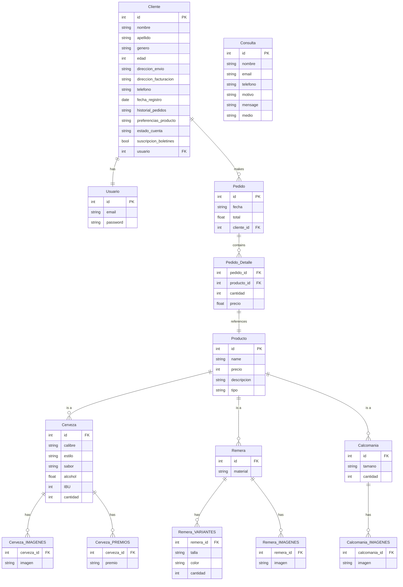

# Pagina Web _Dackel Cerveza_ **Proyecto Node 2024**

El progreso cuidadoso y en pequeños pasos puede parecer lento, pero en realidad es con diferencia la forma más rápida de progresar. El famoso desarrollador de software Robert "Uncle Bob" Martin ha declarado

> "La única manera de ir rápido, es hacerlo bien"
>
> es decir, según Martin, avanzar con cuidado y con pequeños pasos es incluso la única manera de ser rápido.

## @mediasqueries de css Código

```css
/** el codigo que ya escribieron es el descktop o modo escritorio **/

/************** RESPONSIVE ***************/
/****** CELULAR *******/
@media screen and (max-width: 425px) {
}
/****** CELULAR HORIZONTAL Y TABLET PEQUEÑAS *********/

@media screen and (min-width: 426px) and (max-width: 768px) {
}
/****** TABLET ******/
@media screen and (min-width: 768px) and (max-width: 1023px) {
}
```

## BASE DE DATOS


